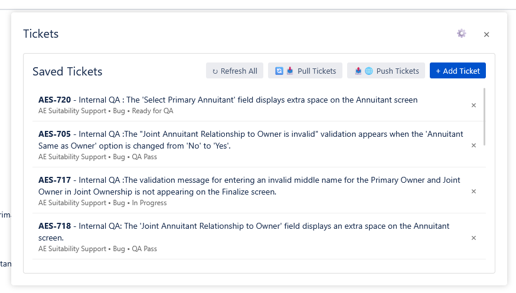
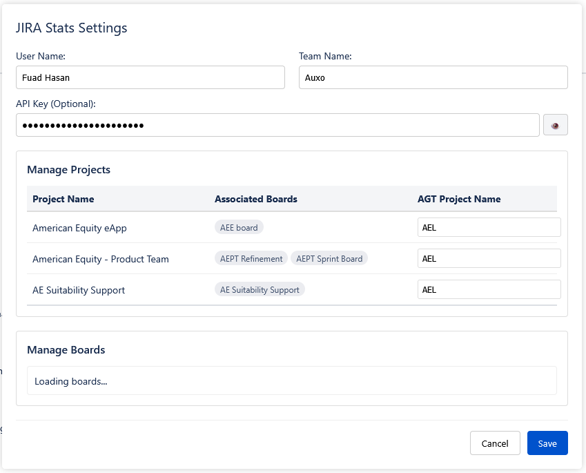
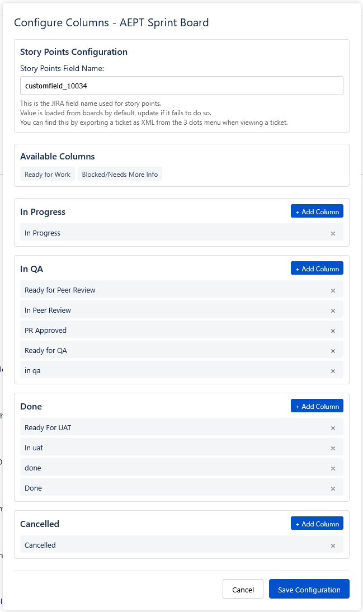
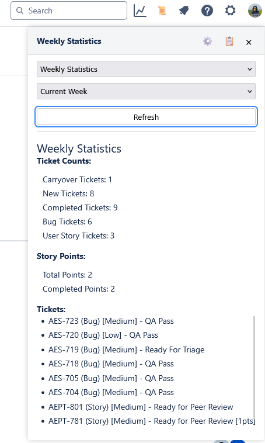
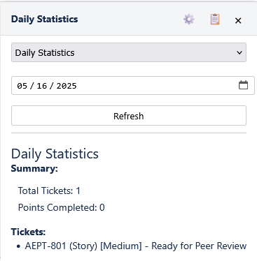
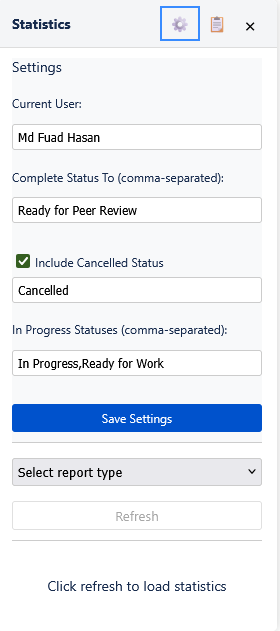

# Jira Standup & Stats Generator

A collection of Tampermonkey scripts to enhance JIRA with statistics generation and stand-up integration features.

**Navigation**

- [Installation](#installation)
- [JIRA Stand Up Script](#jira-stand-up-script)
  - [Features](#features-stand-up)
  - [Logic and Integration](#logic-and-integration-stand-up)
  - [API Integration](#api-integration-stand-up)
  - [UI Components](#ui-components-stand-up)
  - [Screenshots](#screenshots-stand-up)
- [JIRA Stats Script](#jira-stats-script)
  - [Features](#features-stats)
  - [Calculations and Logic](#calculations-and-logic-stats)
  - [API and Query Logic](#api-and-query-logic-stats)
  - [Screenshots](#screenshots-stats)
- [Usage](#usage)
- [Troubleshooting](#troubleshooting)
- [Notes](#notes)

## Installation

### 1. Install Tampermonkey

Install the Tampermonkey browser extension for your browser:

### 1. Install Tampermonkey

#### Chrome

1. Enable Developer Mode:
   - Click the three dots menu (⋯) > Extensions
   - Toggle on "Developer mode" in the bottom left
2. Visit the [Tampermonkey Chrome Web Store page](https://chrome.google.com/webstore/detail/tampermonkey/dhdgffkkebhmkfjojejmpbldmpobfkfo)
3. Click "Add to Chrome"
4. Click "Add extension" in the popup

#### Edge

1. Enable Developer Mode:
   - Click the three dots menu (⋯) > Extensions
   - Toggle on "Developer mode" in the bottom left
2. Visit the [Tampermonkey Edge Add-ons page](https://microsoftedge.microsoft.com/addons/detail/tampermonkey/iikmkjmpaadaobahmlepeloendndfphd)
3. Click "Get" and then "Add extension"

#### Firefox

1. Visit the [Tampermonkey Firefox Add-ons page](https://addons.mozilla.org/en-US/firefox/addon/tampermonkey/)
2. Click "Add to Firefox"
3. Click "Add" in the popup

Follow the prompts to add the extension to your browser.

### 2. Install the Scripts

Install each script by clicking the links below. Tampermonkey will open a new tab for each script. Click the "Install" button on that tab.

1.  **JIRA Stats Script**: [Install Link](https://raw.githubusercontent.com/FuSan21/Jira-Standup-Stats-Generator/refs/heads/main/jira-stats.user.js)
2.  **JIRA Stand Up Script**: [Install Link](https://raw.githubusercontent.com/FuSan21/Jira-Standup-Stats-Generator/refs/heads/main/jira-standup.user.js)

Ensure both scripts are enabled in the Tampermonkey dashboard (click the Tampermonkey icon in your browser toolbar). The scripts will automatically check for updates.

### 3. Initial Setup

1.  Visit your JIRA page (`https://auxosolutions.atlassian.net/*`).
2.  The scripts should automatically inject their respective icons (📈 for Stats, 📜 for Stand Up) into the JIRA header's right-hand side.
3.  **Stats Script**: Click the chart icon (📈), then the gear icon (⚙️) inside the panel. Configure your username (if needed) and status mappings. Click Save.
4.  **Stand Up Script**: Click the scroll icon (📜), then the gear icon (⚙️) inside the modal.
    - Enter your User Name, Team Name, and API Key from AGT website's profile section.
    - Select the boards you work with under "Manage Boards".
    - Configure column mappings for each selected board by clicking its gear icon (⚙️). Ensure you map your JIRA statuses correctly to "In Progress", "Blocked", "In QA", "Done", and "Cancelled". Verify/enter the Story Points Field ID.
    - Configure project name mappings under "Manage Projects" if needed.
    - Click Save.

## JIRA Stand Up Script

Integrates JIRA with an external stand-up reporting system (`allgentech.io`) and provides tools for managing relevant tickets directly within JIRA.

<a id="features-stand-up"></a>

### Features

- **Ticket Management**:
  - Save specific JIRA tickets locally for tracking.
  - Add tickets directly from JIRA's "Your Work" tabs or the ticket details view.
  - Remove tickets from the saved list.
  - Refresh data for all saved tickets from JIRA.
- **External API Sync**:
  - **Pull**: Fetch incomplete tickets assigned to the user from the `allgentech.io` API and merge them into the local saved list.
  - **Push**: Update ticket statuses, story points, and other details in the `allgentech.io` system based on the current state in JIRA. Creates new tickets in the external system if they don't exist. Automatically removes "Done" tickets from the local list after a successful push.
- **Board & Project Configuration**:
  - Fetch and select relevant JIRA Agile boards.
  - Configure status mappings (In Progress, Blocked, In QA, Done, Cancelled) for each selected board to standardize statuses sent to the external API.
  - Configure the custom field ID used for Story Points per board (attempts auto-detection).
  - Map JIRA project names to different names used in the `allgentech.io` system.
- **Configurable Settings**:
  - `currentUser`: JIRA username.
  - `teamName`: Team name for the external API.
  - `apiKey`: API key for authenticating with `allgentech.io`.
  - `savedBoards`: List of selected JIRA Agile boards.
  - `boardConfigs`: Status mappings for each saved board.
  - `savedTickets`: List of locally tracked JIRA tickets.
  - `storyPointsFields`: Custom field ID for story points per board.
  - `savedProjects`: List of projects associated with fetched boards.
  - `boardToProjectMap`: Mapping of board names to project names.
  - `AgtProjectNameMapping`: Mapping of JIRA project names to external system project names.
- **UI Integration**:
  - Injects a "📜" (scroll/list) icon button into the JIRA header.
  - Provides "➕ Add Ticket" buttons on "Your Work" lists and ticket detail pages.
- **Persistence**: Settings (including saved tickets and configurations) are saved in the browser's local storage (shared with Stats script under `jiraStatsSettings`).

<a id="logic-and-integration-stand-up"></a>

### Logic and Integration

- **Ticket Identification**: Uses selectors to find ticket IDs in different JIRA views.
- **Status Mapping**: Uses `boardConfigs` to translate a ticket's current JIRA status (e.g., "Ready for Dev", "Code Review") into a standardized status (e.g., "In Progress", "In QA", "Done") before pushing to the external API. It finds the appropriate board config based on the ticket's project and the configured `boardToProjectMap`.
- **Story Points**: Extracts story points using the configured `storyPointsFields` for the relevant board.
- **Ticket Merging**: When pulling from the external API, it adds tickets that exist remotely but not locally, avoiding duplicates.
- **Update/Create Logic**: When pushing, it identifies tickets needing status updates in the external system and tickets that exist locally but not remotely (creating them if not duplicates).
- **Project Name Mapping**: Uses `AgtProjectNameMapping` to send the correct project identifier to the external API.

<a id="api-integration-stand-up"></a>

### API Integration

- **JIRA APIs**:
  - `/rest/agile/1.0/board`: Fetches available Agile boards.
  - `/rest/agile/1.0/board/{boardId}/configuration`: Fetches board column configuration and estimation settings (for story points field detection).
  - `/rest/api/3/issue/{ticketId}`: Fetches detailed ticket data (summary, status, project, type, story points).
- **External API (`allgentech.io`)**:
  - `GET /api/employee/incomplete-tickets`: Fetches tickets from the external system.
  - `PATCH /api/employee/tickets/{ticketId}`: Updates an existing ticket in the external system.
  - `POST /api/employee/tickets`: Creates a new ticket in the external system.
  - `GET /api/employee/tickets/check-duplicate`: Checks if a ticket name already exists in the external system.

<a id="ui-components-stand-up"></a>

### UI Components

- **Header Button**: "📜" icon opens the Saved Tickets modal.
- **Saved Tickets Modal**:
  - Lists saved tickets with details (ID, name, project, type, status, points).
  - Buttons: Refresh All, Pull Tickets, Push Tickets, Add Ticket (manual entry), Remove Ticket (per ticket).
  - Settings button (⚙️) opens the Settings Modal.
  - Close button (×).
- **Settings Modal**:
  - User Name, Team Name, API Key inputs.
  - Manage Projects: Table showing JIRA projects, associated boards, and input for AGT Project Name mapping.
  - Manage Boards: List of fetched boards with checkboxes to select them and configure (⚙️) buttons.
  - Save/Cancel buttons.
- **Column Configuration Modal**:
  - Opened via the configure (⚙️) button for a board in the Settings Modal.
  - Allows configuration of the Story Points Field ID for the board.
  - Shows available columns and allows assigning them to categories (In Progress, Blocked, In QA, Done, Cancelled) via drag-and-drop or selection modals.
  - Allows adding custom column names.
- **Add Ticket Buttons**: Injected into JIRA UI ("Your Work" lists, Ticket Details) to quickly add tickets to the saved list.

<a id="screenshots-stand-up"></a>

### Screenshots

#### Saved Tickets Modal



#### Settings Configuration



#### Column Configuration



## JIRA Stats Script

Adds a statistics panel to JIRA for tracking ticket progress and generating reports based on status changes.

<a id="features-stats"></a>

### Features

- **Statistics Types**:
  - **Daily Statistics**: Shows tickets moved to a completion status on a specific date.
  - **Weekly Statistics**: Shows ticket progress over different week periods (current week, last week, up to 4 weeks ago).
- **Configurable Settings**:
  - `currentUser`: The JIRA username to track (auto-fetched initially).
  - `completeStatusTo`: Target status(es) considered as "completed" (comma-separated).
  - `inProgress`: Status(es) considered "in progress" to exclude from results (comma-separated).
  - `includeCancelled`: Option to include tickets moved to a specific cancelled status.
  - `cancelledStatus`: The name of the status considered "Cancelled".
  - `timezone`: User's timezone for accurate date calculations (auto-fetched initially).
- **UI**:
  - Injects a chart icon button into the JIRA header.
  - Displays stats in a floating panel with options for report type, date/week selection, and refresh.
  - Settings panel accessible from the stats panel.
  - Copy-to-clipboard button for easy sharing of stats.
  - Loading and error states.
- **Persistence**: Settings are saved in the browser's local storage.

<a id="calculations-and-logic-stats"></a>

### Calculations and Logic

- **Daily Statistics**:
  - **Total Tickets**: Count of tickets whose status changed _to_ one of the `completeStatusTo` statuses (or `cancelledStatus` if included) on the selected date by the `currentUser`.
  - **Points Completed**: Sum of story points from these completed tickets.
- **Weekly Statistics**:
  - **Carryover Tickets**: Tickets assigned to the `currentUser` _before_ the selected week started (determined using JIRA Changelog API).
  - **New Tickets**: Tickets assigned to the `currentUser` _during_ the selected week (determined using JIRA Changelog API).
  - **Completed Tickets**: Count of tickets whose status changed _to_ one of the `completeStatusTo` statuses (or `cancelledStatus` if included) during the selected week by the `currentUser`.
  - **Bug Tickets**: Count of completed tickets marked as "Bug".
  - **User Story Tickets**: Count of completed tickets _not_ marked as "Bug".
  - **Total Points / Completed Points**: Sum of story points from the completed tickets.

<a id="api-and-query-logic-stats"></a>

### API and Query Logic

- **Main Ticket Query (JQL)**: Uses JIRA's search request XML export (`/sr/jira.issueviews:searchrequest-xml/temp/SearchRequest.xml`) with dynamic JQL.
  - **Weekly JQL Example**:
    ```sql
    assignee WAS currentUser() AND status changed TO ("Ready for Peer Review", "Cancelled") DURING (startOfWeek(-1w), endOfWeek(-1w)) AND status NOT IN ("In Progress", "Ready For Work")
    ```
  - **Daily JQL Example**:
    ```sql
    assignee WAS currentUser() AND status changed TO ("Ready for Peer Review", "Cancelled") ON "2025-04-28" AND status NOT IN ("In Progress", "Ready For Work")
    ```
- **Changelog API**: Uses `/rest/api/3/issue/{key}/changelog` for weekly stats to determine the assignment date for carryover/new ticket classification.
- **User API**: Uses `/rest/api/latest/myself` to fetch the current user's display name and timezone for initial settings.

<a id="screenshots-stats"></a>

### Screenshots

#### Weekly Statistics Panel



#### Daily Statistics Panel



#### Settings Configuration



## Usage

### JIRA Stats

1.  Click the chart icon (📈) in JIRA's header.
2.  Select report type (Daily/Weekly).
3.  Choose the specific date or week period.
4.  Click "Refresh" to generate statistics.
5.  Use the copy button (📋) to copy formatted stats.

### JIRA Stand Up

1.  **Adding Tickets**:
    - Click the "➕ Add Ticket..." button next to tickets in the "Your Work" section or on the ticket details page.
    - Alternatively, open the Stand Up modal (📜), click "+ Add Ticket", and enter the ID manually.
2.  **Managing Tickets**:
    - Click the scroll icon (📜) to open the Saved Tickets modal.
    - **Refresh All**: Updates ticket details (status, points, etc.) from JIRA for all saved tickets.
    - **Pull Tickets**: Fetches incomplete tickets from `allgentech.io` and adds any missing ones to your local list.
    - **Push Tickets**: Sends status updates, creates new tickets, and removes completed tickets in the `allgentech.io` system based on your local list and JIRA data.
    - **Remove (×)**: Removes a specific ticket from your local saved list.
3.  **Settings**: Access via the gear icon (⚙️) in the Saved Tickets modal.

## Troubleshooting

- **Icons not appearing**:
  - Ensure Tampermonkey is enabled.
  - Ensure both scripts are enabled in the Tampermonkey dashboard.
  - Refresh the JIRA page (Ctrl+R or Cmd+R).
  - Clear browser cache and cookies for the JIRA domain.
  - Check the browser's developer console (F12) for error messages related to the scripts.
- **Stats not loading/incorrect**:
  - Verify settings (username, statuses) are correct.
  - Check the developer console for API errors (e.g., 401 Unauthorized, 403 Forbidden).
  - Ensure the JQL queries generated (visible in console logs or network requests) are valid for your JIRA setup.
- **Stand Up sync issues**:
  - Verify the API Key and Team Name are correct in settings.
  - Check the developer console for errors during Pull/Push operations (network errors, API errors from `allgentech.io`).
  - Ensure board configurations (status mappings, story point field) are accurate for the projects/tickets you are tracking.
  - Make sure the `@connect allgentech.io` and `@connect auxosolutions.atlassian.net` directives are present in the script headers within Tampermonkey, allowing cross-origin requests.

## Notes

- Both scripts share the same `localStorage` item (`jiraStatsSettings`) to store settings, ensuring consistency for shared values like `currentUser`.
- The Stats script focuses on historical reporting based on status _transitions_.
- The Stand Up script focuses on managing a list of _current_ tickets and syncing their state with an external system.
- Accurate configuration of board statuses and project mappings is crucial for the Stand Up script's external API integration.
- API requests (especially fetching changelogs or pushing multiple updates) can take time. Monitor the UI feedback and console logs.
